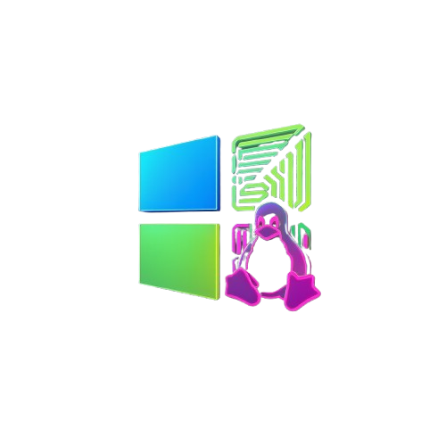

<div align="center">



# WINUX OS

### **O Sistema Operacional Definitivo para Desenvolvedores e Gamers**

*A potência do Linux + A familiaridade do Windows + A elegância do macOS*

[](https://github.com/leonardo-matheus/winux/releases/tag/v1.2.0)
[](LICENSE)
[](https://www.rust-lang.org)
[](docs/APPS.md)
[](https://gtk.org)

[**Download**](#-download) | [**Features**](#-features) | [**Apps**](#-44-apps-nativos) | [**Gaming**](#-gaming) | [**Dev Tools**](#-desenvolvimento) | [**Docs**](docs/)

---

</div>

## O Que é o Winux OS?

**Winux OS** é uma distribuição Linux revolucionária construída do zero para oferecer a **melhor experiência** possível para desenvolvedores e gamers. Com **14 aplicativos nativos** escritos em Rust, 3 modos de interface (Windows/Linux/Mac-like), e ferramentas de desenvolvimento pré-configuradas.

```
╔══════════════════════════════════════════════════════════════════════════════════╗
║                                                                                  ║
║     ██╗    ██╗██╗███╗   ██╗██╗   ██╗██╗  ██╗     ██████╗ ███████╗               ║
║     ██║    ██║██║████╗  ██║██║   ██║╚██╗██╔╝    ██╔═══██╗██╔════╝               ║
║     ██║ █╗ ██║██║██╔██╗ ██║██║   ██║ ╚███╔╝     ██║   ██║███████╗               ║
║     ██║███╗██║██║██║╚██╗██║██║   ██║ ██╔██╗     ██║   ██║╚════██║               ║
║     ╚███╔███╔╝██║██║ ╚████║╚██████╔╝██╔╝ ██╗    ╚██████╔╝███████║               ║
║      ╚══╝╚══╝ ╚═╝╚═╝  ╚═══╝ ╚═════╝ ╚═╝  ╚═╝     ╚═════╝ ╚══════╝               ║
║                                                                                  ║
║     ┌─────────────┐   ┌─────────────┐   ┌─────────────┐   ┌─────────────┐       ║
║     │  14 APPS    │   │  3 MODOS    │   │  GAMING     │   │  DEV TOOLS  │       ║
║     │  NATIVOS    │   │ INTERFACE   │   │  READY      │   │  COMPLETAS  │       ║
║     └─────────────┘   └─────────────┘   └─────────────┘   └─────────────┘       ║
║                                                                                  ║
║     14 Apps Rust | Win/Linux/Mac Modes | ABNT2/US Keyboards | Dev Ready         ║
║                                                                                  ║
╚══════════════════════════════════════════════════════════════════════════════════╝
```

---

## ✨ Features

<table>
<tr>
<td width="50%" valign="top">

### 🖥️ **14 Apps Nativos**
Desenvolvidos em **Rust** para máxima performance:
- 📁 **Files** - Gerenciador de arquivos moderno
- 💻 **Terminal** - Emulador com GPU acceleration
- ⚙️ **Settings** - Central de configurações + idioma
- 🏪 **Store** - Loja de aplicativos
- 📊 **Monitor** - System monitor em tempo real
- ✏️ **Edit** - Editor de texto avançado
- 🖼️ **Image** - Visualizador de imagens
- 🎵 **Player** - Player multimídia
- ℹ️ **About** - Informações do sistema
- 🎨 **Personalize** - Modos Win/Linux/Mac
- 🔧 **Env Manager** - Variáveis de ambiente

### 🚀 Performance Extrema
- **Kernel Linux Zen 6.8+** otimizado
- **Compositor Wayland** (Smithay) nativo
- **PipeWire** para áudio de baixa latência
- **GameMode** e **MangoHud** integrados

</td>
<td width="50%" valign="top">

### 💻 Desenvolvimento Completo
- **.NET 8**, **C++**, **Rust**, **Swift**, **Go**, **Java**
- **Android Studio** + SDK/NDK
- **Flutter** + **React Native**
- **VS Code**, **JetBrains**, **Neovim**
- **Docker** + **Podman**

### 🎮 Gaming First-Class
- **Steam**, **GOG**, **Epic Games** (via Heroic)
- **Wine 9.0** + **Proton GE**
- **DXVK** + **VKD3D**
- **RetroArch** + emuladores
- Otimização automática por jogo

### 📱 Mobile Development
- **Android** APK/AAB builds
- **iOS** IPA (via Theos/ldid)
- **Flutter** cross-platform
- **React Native** toolchain
- **Swift** para Linux

</td>
</tr>
</table>

---

## 📦 44 Apps Nativos

Todos escritos em **Rust** com **GTK4/Libadwaita** para máxima performance e design moderno.

### Core Apps

| App | Descrição | Features |
|:----|:----------|:---------|
| **📁 Files** | Gerenciador de arquivos | Multi-abas, preview, compatibilidade Win/Mac/Linux |
| **💻 Terminal** | Emulador de terminal | GPU-accelerated, tabs, profiles |
| **⚙️ Settings** | Central de configurações | 15+ páginas, integração sistema |
| **🏪 Store** | Loja de aplicativos | APT + Flatpak + Snap unificado |
| **📊 Monitor** | System monitor | CPU, RAM, GPU, rede em tempo real |
| **📝 Edit** | Editor de texto | Syntax highlighting, LSP |
| **🖼️ Image** | Visualizador de imagens | Filtros, edição básica, batch |
| **🎬 Player** | Player multimídia | Vídeo, áudio, playlists |

### Produtividade

| App | Descrição | Features |
|:----|:----------|:---------|
| **📅 Calendar** | Calendário e tarefas | CalDAV sync, lembretes, tarefas |
| **📝 Notes** | Notas (estilo Keep) | Markdown, cores, tags, SQLite FTS |
| **👥 Contacts** | Gerenciador de contatos | CardDAV sync, vCard import/export |
| **📧 Mail** | Cliente de email | IMAP/SMTP, OAuth2, HTML |
| **🧮 Calculator** | Calculadora | Básica, científica, programador, conversões |
| **🕐 Clock** | Relógio | World clock, alarmes, cronômetro, timer |
| **🌤️ Weather** | Previsão do tempo | Open-Meteo API, 7 dias, hourly |

### Utilitários

| App | Descrição | Features |
|:----|:----------|:---------|
| **📋 Clipboard** | Gerenciador de clipboard | Histórico, criptografia, Super+V |
| **📸 Screenshot** | Captura de tela | Região, janela, editor, blur |
| **🎥 Screencast** | Gravador de tela | H.264/VP9/AV1, áudio, GIF |
| **🎙️ Recorder** | Gravador de voz | WAV/MP3/OGG/FLAC, waveform |
| **📷 Camera** | Câmera | Foto, vídeo, filtros, PipeWire |
| **📄 Documents** | Visualizador PDF | PDF, EPUB, DjVu, anotações |
| **📦 Archive** | Gerenciador de arquivos | ZIP, RAR, 7z, TAR, ISO |
| **🔤 Fonts** | Gerenciador de fontes | Preview, instalar, comparar |

### Sistema

| App | Descrição | Features |
|:----|:----------|:---------|
| **🔋 Power** | Gerenciador de energia | Bateria, perfis, TLP |
| **🌐 Network** | Gerenciador de rede | WiFi, VPN, Hotspot, Proxy |
| **📶 Bluetooth** | Gerenciador Bluetooth | Pareamento, transferência |
| **💾 Disks** | Gerenciador de discos | Partições, SMART, benchmark |
| **👤 Users** | Gerenciador de usuários | Contas, grupos, permissões |
| **🔥 Firewall** | Gerenciador de firewall | UFW/FirewallD, regras |
| **🖨️ Printers** | Gerenciador de impressoras | CUPS, scan, fila |
| **📋 Logs** | Visualizador de logs | Journal, kernel, apps |
| **🔄 Updater** | Atualizador de software | APT, Flatpak, Snap, firmware |
| **💾 Backup** | Sistema de backup | Local, rsync, Restic, cloud |
| **♿ Accessibility** | Acessibilidade | Screen reader, zoom, filtros |

### Desenvolvimento

| App | Descrição | Features |
|:----|:----------|:---------|
| **🛠️ Dev Hub** | Central do desenvolvedor | Projetos, ambientes, containers |
| **🏗️ Builder** | Build cross-platform | .exe, .deb, .dmg, .AppImage |
| **📱 Mobile Studio** | IDE mobile | Android, iOS, Flutter, React Native |
| **🎮 Gaming** | Launcher unificado | Steam, GOG, Epic, emuladores |

### Personalização

| App | Descrição | Features |
|:----|:----------|:---------|
| **🎨 Personalize** | Personalização | Temas, wallpapers, estilos |
| **🌍 Env Manager** | Variáveis de ambiente | Perfis, PATH, exports |
| **ℹ️ About** | Informações do sistema | Hardware, software, specs |
| **👋 Welcome** | Onboarding | Setup inicial, tutoriais |

### Desktop Components

| Componente | Descrição |
|:-----------|:----------|
| **Compositor** | Wayland compositor (Smithay) |
| **Panel** | Barra superior com widgets |
| **Shell** | Desktop shell e dock |
| **Launcher** | App launcher estilo Spotlight |
| **Notifications** | Daemon de notificações |
| **Control Center** | Quick settings estilo iOS |

---

## 🎨 7 Temas Premium

<table>
<tr>
<td align="center" width="14%">
<br>
<b>Fluent</b><br>
<sub>Glassmorphism</sub>
</td>
<td align="center" width="14%">
<br>
<b>Nord</b><br>
<sub>Arctic</sub>
</td>
<td align="center" width="14%">
<br>
<b>Dracula</b><br>
<sub>Dark Vibrant</sub>
</td>
<td align="center" width="14%">
<br>
<b>Catppuccin</b><br>
<sub>4 Variantes</sub>
</td>
<td align="center" width="14%">
<br>
<b>Icons</b><br>
<sub>105 SVGs</sub>
</td>
<td align="center" width="14%">
<br>
<b>Cursors</b><br>
<sub>Multi-DPI</sub>
</td>
<td align="center" width="14%">
<br>
<b>Plymouth</b><br>
<sub>Boot Animation</sub>
</td>
</tr>
</table>

**Features dos Temas:**
- 80+ animações CSS a 60fps
- Glassmorphism com backdrop-filter
- Micro-interações (hover, active, focus)
- Dark e Light mode
- Accent colors customizáveis

---

## 🎮 Gaming

```
┌────────────────────────────────────────────────────────────────────────────────┐
│                           WINUX GAMING CENTER                                   │
├────────────────────────────────────────────────────────────────────────────────┤
│                                                                                │
│   ┌──────────────┐  ┌──────────────┐  ┌──────────────┐  ┌──────────────┐      │
│   │    STEAM     │  │     GOG      │  │    EPIC      │  │   LUTRIS     │      │
│   │   Library    │  │   Galaxy     │  │   (Heroic)   │  │   Runners    │      │
│   └──────────────┘  └──────────────┘  └──────────────┘  └──────────────┘      │
│                                                                                │
│   ┌────────────────────────────────────────────────────────────────────┐      │
│   │  COMPATIBILITY LAYER                                                │      │
│   │  ┌─────────┐ ┌─────────┐ ┌─────────┐ ┌─────────┐ ┌─────────┐      │      │
│   │  │Wine 9.0 │ │Proton GE│ │  DXVK   │ │ VKD3D   │ │GameMode │      │      │
│   │  └─────────┘ └─────────┘ └─────────┘ └─────────┘ └─────────┘      │      │
│   └────────────────────────────────────────────────────────────────────┘      │
│                                                                                │
│   ┌────────────────────────────────────────────────────────────────────┐      │
│   │  EMULATORS                                                          │      │
│   │  RetroArch │ Dolphin │ PCSX2 │ RPCS3 │ Ryujinx │ Cemu │ Vita3K    │      │
│   └────────────────────────────────────────────────────────────────────┘      │
│                                                                                │
└────────────────────────────────────────────────────────────────────────────────┘
```

**Features:**
- Launcher unificado para todas as plataformas
- **Proton/Wine** configuração automática por jogo
- **MangoHud** overlay com presets
- **GameMode** otimização de CPU/GPU
- Per-game settings (Wine version, env vars, launch options)

---

## 💻 Desenvolvimento

### Linguagens Suportadas

| Linguagem | Ferramentas |
|:----------|:------------|
| **Rust** | rustc 1.75+, cargo, clippy, rustfmt, rust-analyzer |
| **.NET** | dotnet 8.0, C# 12, F# 8, VB.NET, NuGet |
| **C/C++** | GCC 13+, Clang 17+, CMake, Make, ccache |
| **Java** | OpenJDK 21, Maven, Gradle, Spring Boot |
| **Python** | 3.12+, pip, poetry, pipenv, pyenv |
| **Node.js** | 20 LTS, npm, yarn, pnpm, nvm |
| **Go** | 1.22+, gopls, golangci-lint |
| **Swift** | 5.9+ (Linux), SPM, SourceKit-LSP |
| **PHP** | 8.3+, Composer, Laravel |
| **Ruby** | 3.3+, gem, bundler, rbenv |

### Mobile Development

```
┌──────────────────────────────────────────────────────────────────┐
│                    WINUX MOBILE STUDIO                            │
├──────────────────────────────────────────────────────────────────┤
│                                                                  │
│   ANDROID                    iOS                    CROSS        │
│   ┌─────────────┐           ┌─────────────┐       ┌─────────────┐│
│   │ SDK + NDK   │           │ Swift       │       │ Flutter     ││
│   │ Gradle      │           │ Theos       │       │ React Native││
│   │ Kotlin      │           │ ldid        │       │ Capacitor   ││
│   │ Emulator    │           │ IPA signing │       │ Cordova     ││
│   └─────────────┘           └─────────────┘       └─────────────┘│
│                                                                  │
│   OUTPUT:  APK │ AAB │ IPA* │ .deb (jailbreak)                  │
│                                                                  │
│   * iOS builds limitados no Linux - requer Mac para App Store   │
└──────────────────────────────────────────────────────────────────┘
```

### Build Cross-Platform

O **Winux Builder** permite compilar para todas as plataformas:

| Target | Formatos | Ferramentas |
|:-------|:---------|:------------|
| **Linux** | .deb, .rpm, .AppImage, .flatpak, .snap | dpkg, rpmbuild, appimagetool |
| **Windows** | .exe, .msi | mingw-w64, wixl |
| **macOS** | .app, .dmg, .pkg | osxcross, create-dmg |

---

## 🔧 Scripts de Otimização

| Script | Função |
|:-------|:-------|
| `optimize-performance.sh` | CPU governor, IO scheduler, ZRAM, kernel tuning |
| `optimize-gaming.sh` | GameMode, GPU power, shader cache, compositor |
| `optimize-battery.sh` | TLP, PowerTop, brightness, WiFi powersave |
| `optimize-dev.sh` | File watchers, Docker/Podman, ccache, IDE settings |
| `system-cleanup.sh` | Package cache, logs, thumbnails, old kernels |

Todos com `--dry-run`, `--restore`, `--status` e logging completo.

---

## 📊 Estatísticas do Projeto

```
┌────────────────────────────────────────────────────────────────┐
│                    WINUX OS - ESTATÍSTICAS                      │
├────────────────────────────────────────────────────────────────┤
│                                                                │
│   Arquivos Rust         │████████████████████████│  591+      │
│   Linhas de Código      │████████████████████████│  150,000+  │
│   Apps Nativos          │████████████████████████│  44        │
│   Componentes Desktop   │████████████████████████│  6         │
│   Temas                 │████████████████████████│  7         │
│   Scripts Shell         │████████████████████████│  28+       │
│   Ícones SVG            │████████████████████████│  105       │
│   Documentação          │████████████████████████│  3,400+ ln │
│                                                                │
└────────────────────────────────────────────────────────────────┘
```

---

## 📥 Download

<div align="center">

### 🎉 **Winux OS 1.2 Blaze - Developer Edition**

| Edição | Tamanho | Descrição | Link |
|:------:|:-------:|:---------:|:----:|
| **Winux 1.2 Blaze** | 3.7 GB | 14 apps nativos Rust, Desktop Environment completo | [⬇️ **GitHub Release**](https://github.com/leonardo-matheus/winux/releases/tag/v1.2.0) |

**Requisitos Mínimos:** CPU x86_64 SSE4.2, 4GB RAM, 30GB SSD, Vulkan 1.1

**Requisitos Recomendados:** Ryzen 5/i5 6+ cores, 16GB RAM, 100GB NVMe, RTX 3060/RX 6700 XT

</div>

### ✨ Novidades da v1.2 Blaze

- **14 Apps Nativos em Rust** - Terminal, Settings, Store, Monitor, Edit, Image, Player, About, Personalize, Env-Manager + Desktop Components
- **Desktop Environment** - Compositor Wayland, Panel, Shell
- **3 Modos de Interface** - Windows-like, Linux-like, Mac-like
- **Idiomas** - Português (Brasil) e English (USA)
- **Teclados** - ABNT2 e US International
- **Dev Tools** - VS Code, IntelliJ, PHP, Java, Node.js, Python, Rust, Docker
- **Gaming** - Wine 9.0, Lutris, GameMode, MangoHud

### 🔐 Verificação de Integridade

```bash
# SHA256
echo "a7ceee56bb4af6f9ab375a848c4cce20e5aca7adb3eaf99f6aae03aacf806d88  winux-1.2-blaze-amd64.iso" | sha256sum -c

# MD5
echo "72744674156987d0b4f6cadf3294a70f  winux-1.2-blaze-amd64.iso" | md5sum -c
```

---

## 🚀 Instalação

### USB Bootável

```bash
# Linux
sudo dd if=winux-1.2-blaze-amd64.iso of=/dev/sdX bs=4M status=progress

# Windows - Usar Rufus ou balenaEtcher
```

### Build from Source

```bash
git clone https://github.com/winux-os/winux.git
cd winux

# Dependências (Ubuntu/Debian)
sudo apt install build-essential libgtk-4-dev libadwaita-1-dev

# Build
cargo build --release --workspace

# Build ISO
sudo ./build/scripts/build-winux-iso.sh
```

### Pós-Instalação

```bash
winux-update                    # Atualizar sistema
sudo winux-drivers --nvidia     # Drivers NVIDIA
winux-dev-setup                 # Ambiente de desenvolvimento
winux-gaming-setup              # Configurar gaming
```

---

## 📚 Documentação

| Documento | Descrição |
|:----------|:----------|
| [**APPS.md**](docs/APPS.md) | Documentação completa dos 44 apps |
| [**DEVELOPER.md**](docs/DEVELOPER.md) | Guia para desenvolvedores |
| [**MOBILE.md**](docs/MOBILE.md) | Desenvolvimento mobile |
| [**CHANGELOG.md**](docs/CHANGELOG.md) | Histórico de mudanças |
| [**CONTRIBUTING.md**](CONTRIBUTING.md) | Como contribuir |

---

## 🗺️ Roadmap

### v1.0 Aurora (2026) ✅
- [x] 14 Apps nativos em Rust
- [x] 3 Modos de interface (Win/Linux/Mac)
- [x] Idiomas PT-BR e EN-US
- [x] Teclados ABNT2 e US
- [x] Dev tools pré-configuradas
- [x] Gaming com Wine e Lutris

### v1.2 Blaze (2026) ✅
- [x] Desktop Environment otimizado
- [x] 14 Apps compilados e funcionais
- [x] ISO menor e mais rápida

### v1.3 Cosmos (2026)
- [ ] Winux Connect (integração smartphone)
- [ ] Cloud sync nativo
- [ ] Plugins para shell
- [ ] AI Assistant

### v2.0 Cosmos (2027)
- [ ] ARM64 support
- [ ] Immutable OS mode
- [ ] Container GUI (Podman)
- [ ] Wayland HDR completo

---

## 🤝 Comunidade

<div align="center">

[](https://discord.gg/winux)
[](https://reddit.com/r/winuxos)
[](https://twitter.com/winuxos)
[](https://github.com/winux-os/winux)

</div>

---

## 📄 Licença

| Componente | Licença |
|:-----------|:--------|
| Sistema e Scripts | [GPL v3](LICENSE-GPL) |
| Aplicações Winux | [MIT](LICENSE-MIT) |
| Documentação | [CC BY-SA 4.0](https://creativecommons.org/licenses/by-sa/4.0/) |

---

<div align="center">


**Winux OS** - *O Melhor dos Três Mundos*

**2026** | Feito com ❤️ em Rust

⭐ Se você gostou do projeto, considere dar uma estrela!

</div>
